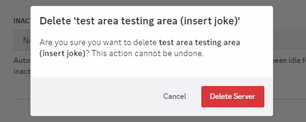

[](https://github.com/biaw/test-area/actions/workflows/docker-compose-test.yml)
[](https://github.com/biaw/test-area/actions/workflows/linting.yml)
[](https://github.com/biaw/test-area/actions/workflows/testing.yml)
[](https://www.npmjs.com/package/discord.js)
[](https://github.com/biaw/test-area/issues)
[](https://github.com/biaw/test-area/pulls)

# Test Area

> *Endlessly tired of making and deleting test servers and having to enter that painful two-factor code? Pssh, that was so 2020...*

Test Area is a self-hosted Discord bot that creates temporary servers for you to test your other bots on.

## Motivation

This started as a side-gig in April 2021 after I got tired of making a lot of testing servers, then wanting to clean them up, only having to insert that bloody two-factor code.

<picture>
  <source media="(prefers-color-scheme: dark)" srcset="./videos/pain-dark.gif">
  
</picture>

Nowadays we have security keys, but the pain is still there. Wouldn't it be nice to just ... delete using a simple command? Maybe like this?

<picture>
  <source media="(prefers-color-scheme: dark)" srcset="./videos/self-destruct-dark.gif">
  
</picture>

So, here we are.

## Prerequisites

You only need Docker (and Docker Compose) to self-host this bot.

## Installation

Test Area comes in a Docker image: `ghcr.io/biaw/test-area`, which it makes it really simple to set up using Docker.

1. You will need at least two bots set up.
    - The first bot will be your main bot. Set it up like this:
        - Installation: Set to User Install only, without an install link.
        - Bot: Make sure it is private. Reset the token and save it.
    - The second one will be your worker bot. Set it up like this:
        - Installation: Set to Guild Install only, without an install link.
        - Bot: Make sure it is private, and that all intents are enabled. Reset the token and save it.
2. Copy the `example.env` file to `.env` in a new folder, and fill in its values. The first bot token goes in `CLIENT_TOKEN`, and the second bot token goes in `WORKER_TOKENS`. The `OWNER_ID` is your Discord user ID. The rest is optional.
3. Copy the following `docker-compose.yml` file to the same folder:

```yaml
services:
  bot:
    image: ghcr.io/biaw/test-area:latest
    restart: always
    env_file: .env
    environment:
      - CLIENT_TOKEN=$CLIENT_TOKEN
      - WORKER_TOKENS=$WORKER_TOKENS
      - DATABASE_URI=mongodb://db
      - OWNER_ID=$OWNER_ID
      - THEME_COLOR=$THEME_COLOR
      - AREA_LIMIT_PER_USER=$AREA_LIMIT_PER_USER
      - DISABLE_FUNNY_WORKER_NAMES=$DISABLE_FUNNY_WORKER_NAMES
    volumes:
      - ./logs:/app/logs
    depends_on:
      - db
  db:
    image: mongo:8
    restart: always
    volumes:
      - ./database:/data/db
```

4. Run `docker-compose up -d` in the folder where you saved the `docker-compose.yml` file.
5. Invite the user bot to your server using this link: https://canary.discord.com/oauth2/authorize?client_id=YOUR_BOT_ID
6. You're done! You can now use the bot using the main `/testarea` command.

## FAQ

### Why do I need two bots?

A simple answer is that a Discord bot can only create new guilds when it's in less than 10 guilds. This is a limitation set by Discord. We've therefore implemented the simplest workaround possible: a second bot dedicated in creating guilds.

### Can I have more than 10 test areas?

Yes, you can. A worker bot can only create 10 guilds total, so if you want more then you will need to add a second worker. If you want more than 20, add a third worker, and so on.

You can do this by supplying multiple worker tokens in the `WORKER_TOKENS` environment variable, separated by a comma.

### Why does my worker bots have new names, like `harsh handsaw#7622` or `sumptous titanium#4604`?

When initializing a new worker, the worker needs a name for logging. So, naturally, as any chaotic evil programmer would do, I decided to add a name generator based on the bot ID.

However, you can disable this by setting the environment variable `DISABLE_FUNNY_WORKER_NAMES` to `true`.
